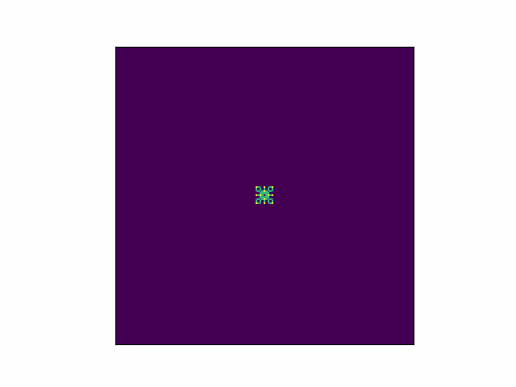

# Changeful-cellular-patterns

EN: Based on simple rules, cellular automata can continuously iterate out beautiful patterns. This time, I use a two-dimensional matrix to store the states of cells and define a rule: if the sum of the state values of neighboring cells is a multiple of n, then the state value of the central cell in the next generation is n. I used Python for programming and collected many exquisite patterns. After that, I also used Processing programming to make each generation's patterns fill the entire canvas, and the attached code can be run directly on Processing.
I have also achieved a similar effect using Python, and the attached code is attached.

CN: 基于简单的规则，元胞自动机就可以不断迭代出美丽的图案。这次我用二维矩阵存储元胞的状态，并定义规则：如果邻域元胞的状态值之和是n的倍数，那么中心元胞在下一代的状态值就是n。我用Python进行编程，收集了许多精美的图案。在那之后，我还用Processing编程，使每一代的图案都能够充斥整个画布，附件的代码可以直接在Processing上面运行。
我用Python也实现过类似的效果，附件为代码。

